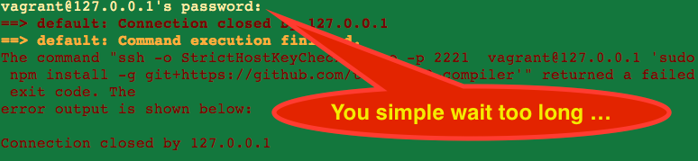

### t2-vm create events.js:85
```
vagrant-osx:~ vagrant$ t2-vm create
Initializing VM...
? Choose a bridge interface (or hit enter) en0: Ethernet
Downloading image...
............................................................ downloaded ...
Creating VM...
Attaching to serial port: /Users/vagrant/.tessel/vm.port
Configuring VM...
events.js:85
      throw er; // Unhandled 'error' event
            ^
Error: connect ENOENT
    at exports._errnoException (util.js:746:11)
    at PipeConnectWrap.afterConnect [as oncomplete] (net.js:1010:19)
```
This is a known error happens only on the guest VM - using t2-vm create on a host (so not within a virtual machine) will work properly.

### SSH Connection closed directly



If you wait too long. In most cases you left your desktop while `vagrant up` is running. Because of the trigger is after up, it is the last what is done after all things are ready. So you simple do once more:

```
vagrant up
```
and stay where you are while typing this ... :smile:

If you are sure there is no intruder next to your computer who knows the top secret password ssh `vagrant` ... you also can remove the fingerprint out of your `.ssh/known_hosts` :bomb: ... that way it is easier for the attacker to send a new fingerprint to you :fire: 
