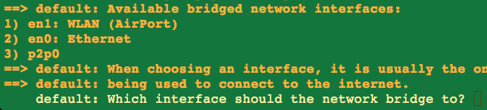

### Installation

After you've [installed vagrant](http://www.vagrantup.com/downloads) copy the [Vagrantfile](Vagrantfile) and run
```
vagrant up
```
select the network device




followed by
```
vagrant ssh
```
---
**Attention:** It isn't possible to do conditional parts within the trigger **after up** what means a third execution of `vagrant up` will copy files to autostart (thats very stupid!). So please comment the **run** commands in that block away after your box is successfully setten up.
```
if ARGV[0] == 'up'
    config.trigger.after :up do
      #run "echo 'I am uncommented after second vagrant up by YOU !!!..."+port.to_s+"'"
    end
end
```

---
