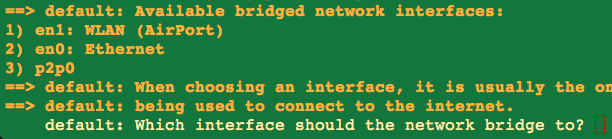

### Installation

After you've [installed vagrant](http://www.vagrantup.com/downloads) copy the [Vagrantfile](Vagrantfile) and run
```
vagrant up
```
select the network device




followed by
```
vagrant ssh
```
*maybe the download of the base box will take 20h once :smile:
