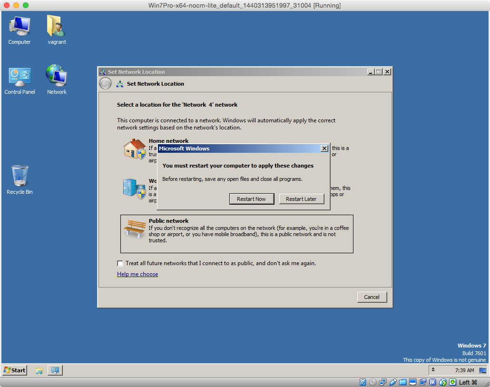
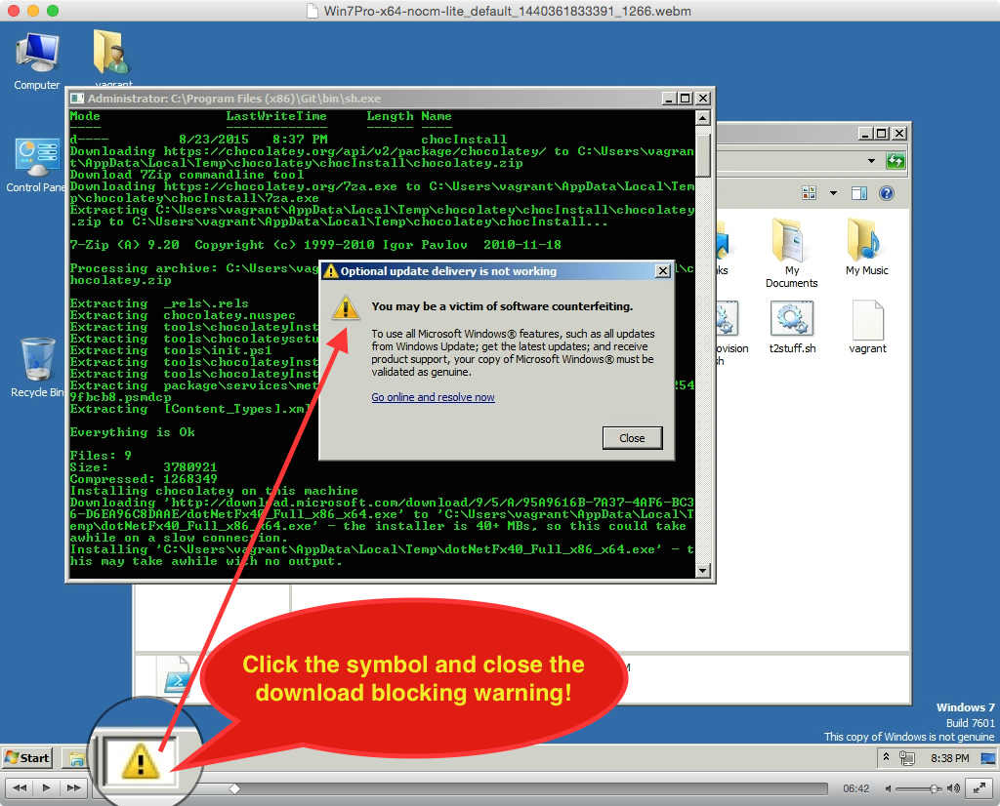

Different to the Mac OS X Yosemite and Ubuntu 14.04 VirtalBox VM this Windows 7 Professional VM needs a GUI to run the autostart part.

The problem of provisioning Windows based VMs is to automatize this the Vagrant way. So we use a base box what has already installed Git and its command line tools. That way we are able to ignore vagrants primary way for windows boxes, the `communicator = "winrm"`. The winrm-way doesn't work on Linux or Mac OS X based hosts used for provisioning (in our case).

We decided to use Windows 7 because it is usable after evaluation phase with acceptable problems (e.g. annoying warnings what will brake the provisioning).

After you have gone through the GUI based installation you will be able to use the common `vagrant ssh` to work on command line as wanted.

### Installation

After you've [installed vagrant](http://www.vagrantup.com/downloads) copy the [Vagrantfile](Vagrantfile), [provision.sh](provision.sh), [postprovision.sh](postprovision.sh) and [t2stuff.sh](t2stuff.sh) into a local folder.

**Note**: It is not as comfortable as wished, so you have to read the following steps. If you feel confused, please take a look at [FAQ](FAQ.md) - where we described all common potential misconceptions.

```
vagrant up
```
At the very beginning you will be asked to select one of the provided *bridge network devices*. Don't know your network topology but in most cases the first one should be the right.

**Node**: You will notice we set an additional port forwarding. The reason is we need this for automatizing things (we couldn't properly catch the guest_port param - so we had to go this way to manage the dynamic behavior of vagrants port collision management)

At the point the GUI shows up, you do not need to wait long to see and `winrm` related error. At this point you simple 

```
vagrant up
```
a second time!

Now you will be asked for *ssh pasword* (vagrant) four times. At this point the provision.sh will be copied to the autostart folder. Also the postprovision.sh and t2stuff.sh will be copied to c:\Users\vagrant where they are moved to autostart at the right step by provision.sh, what deletes itself after execution.

---
**Attention:** It isn't possible to do conditional parts within the trigger **after up** what means a third execution of `vagrant up` will copy files to autostart (thats very stupid!). So please comment the **run** commands in that block away after your box is successfully setten up.
```
if ARGV[0] == 'up'
    config.trigger.after :up do
      #run "echo 'I am uncommented after second vagrant up by YOU !!!..."+port.to_s+"'"
    end
end
```

---

The last ssh password you enter is to initialize the reboot followed by autostart provisioning.

Now it is time to take a look at the GUI. There is a waiting message like  **<p style="color:green"> Welcome to Git...</p>**

Now your job is to look for a yellow warning:



Thats the major job you have to do. If something doesn't work fine, first reboot before giving up hope - it is Windows ...
